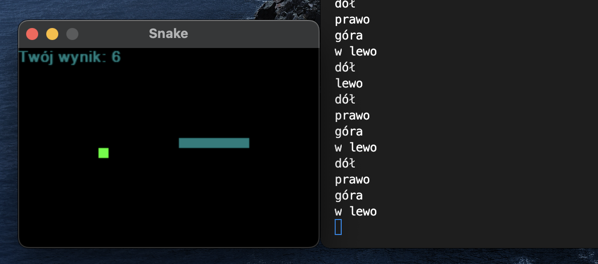

# Voice controlled Snake Game (PL)



Voice controlled Snake game with Polish language - it offers 3 speech recognition methods:
- `python main.py sr` (default) - uses `speech_recognition` library and Google's ASR API;
- `python main.py whisper` - uses `Whisper` model from OpenAI, whereby transcription takes place locally. Speed depends on your computer capabilities ([Hugging Face](https://huggingface.co/openai/whisper-large));
- `python main.py facebook` - `facebook/wav2vec2-base-10k-voxpopuli-ft-pl` model ([Hugging Face](https://huggingface.co/facebook/wav2vec2-base-10k-voxpopuli-ft-pl));

This game is fully playable and provides a decent experience. It is also a good example of how to use speech recognition models in practice.

Every 1.5 seconds of the game selected model performs speech recognition and controls snake's movement direction.
The best results could be achieved using Google's API, as transcription on Google's server turned out to be the fastest, and its quality is often better than what can be achieved with "tiny" or "base" versions of the `Whisper` model or by `facebook/wav2vec2-base-10k-voxpopuli-ft-pl` model. With a more powerful machine, local processing could be the faster option.

The models and it's variants (tiny, base, medium...) that were used can be easily modified and new ways of speech recognition can be added.

### Requirements:
```
pip install SpeechRecognition
pip install pygame
pip install git+https://github.com/openai/whisper.git -q
pip install transformers
```

